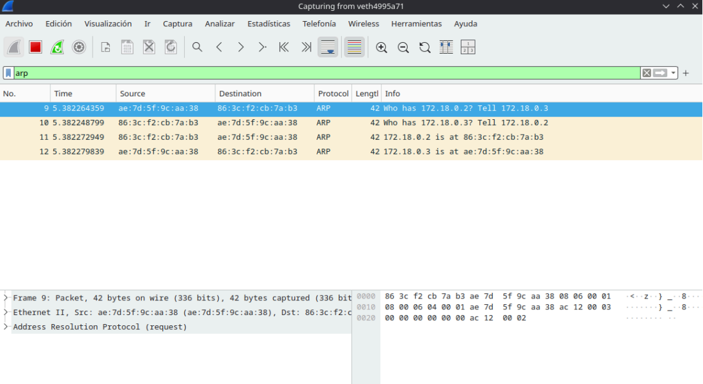

# Punto 2 — Descubriendo el protocolo ARP

## Objetivo
Visualizar el proceso de resolución ARP cuando un host necesita conocer la dirección
MAC de otro dispositivo en la misma red.

---

## Herramientas necesarias

```bash
# Instalar Wireshark en Arch Linux
sudo pacman -S wireshark-qt

# Agregar el usuario al grupo wireshark para evita usar sudo
sudo usermod -aG wireshark $USER
newgrp wireshark
```
---

## Escenario Docker

### Paso 1 — Crear la red bridge personalizada

```bash
docker network create --driver bridge red_arp
```

Este comando crea una red virtual de tipo bridge llamada `red_arp`. Los contenedores
conectados a ella pueden comunicarse entre sí como si estuvieran en la misma red local.

### Paso 2 — Lanzar los dos contenedores

**Terminal A — contenedor1:**
```bash
docker run -it --name contenedor1 --network red_arp alpine sh
```

**Terminal B — contenedor2:**
```bash
docker run -it --name contenedor2 --network red_arp alpine sh
```
### Paso 3 — Instalar herramientas dentro de cada contenedor

> **Corrección importante:** El taller original sugería instalar `arping` e `iputils`
> juntos, pero generan conflicto en Alpine porque ambos intentan instalar el comando
> `arping` en versiones incompatibles. La solución fue instalar solo `iputils`,
> ya que Alpine incluye `ping` por defecto con busybox.

Despues se ejecuta esto **dentro de contenedor1 y contenedor2**:
```sh
apk update && apk add arping
```

Verificar que las herramientas están disponibles:
```sh
# ping ya viene con Alpine
ping -c 1 contenedor2

# verficar si arping esta instalado
arping --help
```
---

## Identificar la interfaz correcta en Wireshark

Como los contenedores están en una red personalizada (`red_arp`) y no en el bridge
por defecto de Docker, el tráfico **no pasa por `docker0`** sino por una interfaz
virtual `veth` asociada al bridge de `red_arp`.

Para identificar la interfaz correcta se debe ejecutar en el host los siguiente:

```bash
# Ver el bridge asociado a red_arp
docker network inspect red_arp | grep bridge

# Ver qué interfaces están conectadas a ese bridge
brctl show
```
---

## Preparación de Wireshark

```bash
wireshark
```

- Seleccionar la interfaz `veth` correspondiente a `red_arp` (identificada en el paso anterior) o seleccionar `any`
- Aplicar el filtro de captura: `arp`

---

### Averiguar las IPs de cada contenedor

**En ambos contededires ejecutar:**
```sh
ip addr show
```

### Limpiar la caché ARP del host

Esto fuerza una nueva resolución ARP desde cero, haciendo visible el intercambio
completo en Wireshark:

```bash
sudo ip neigh flush all
```

### Iniciar la captura en Wireshark

Activar la captura con el filtro `arp`.

### Generar tráfico ARP desde contenedor1

```sh
ping -c 4 172.18.0.3
```

### Detener la captura en Wireshark

Observar los paquetes capturados.

---



## Análisis y respuestas

### ¿Quién envía la trama ARP?

La trama ARP de solicitud es enviada por **contenedor1** (172.18.0.2).
En Wireshark se puede ver:
- **MAC de origen:** la dirección MAC de contenedor1
- **MAC de destino:** `ff:ff:ff:ff:ff:ff` (broadcast)

### ¿A qué dirección MAC va dirigida la solicitud ARP?

La solicitud ARP va dirigida a la dirección **broadcast `ff:ff:ff:ff:ff:ff`**.

Esto ocurre porque en el momento de la solicitud, contenedor1 no conoce la dirección
MAC de contenedor2. Al no conocerla, debe preguntar a **todos los dispositivos**
de la red al mismo tiempo. Todos los dispositivos reciben el mensaje, pero solo el que tenga esa IP responde.

### ¿La respuesta ARP es broadcast o unicast?

La respuesta ARP es **unicast**.

Una vez que contenedor2 recibe la solicitud broadcast y reconoce que la IP preguntada
es la suya, responde directamente a la MAC de contenedor1 que conoce gracias a
la solicitud.

### ¿Por qué es necesario el ARP?

El protocolo IP opera a nivel lógico usando direcciones IP, pero la comunicación
real en una red local ocurre a nivel físico usando direcciones MAC. El hardware
de red no entiende de IPs, solo de MACs.

ARP es el puente entre estos dos mundos ya que cuando un dispositivo quiere enviar datos
a una IP dentro de su misma red, necesita primero descubrir qué dirección MAC
corresponde a esa IP. ARP resuelve esa pregunta mediante el intercambio de
solicitud broadcast y respuesta unicast.

Sin ARP, sería imposible construir la trama Ethernet necesaria para enviar
el paquete IP al destino correcto dentro de la red local.

### ¿Qué información se almacena en la caché ARP después del intercambio?

Después del intercambio, el contenedor1 almacena en su
**tabla ARP** (caché ARP) la siguiente entrada:

```
IP 172.18.0.3  →  MAC <dirección MAC de contenedor2>
```

Esta caché tiene un tiempo de vida limitado (TTL). Mientras la entrada esté vigente,
contenedor1 no necesita volver a hacer una solicitud ARP para comunicarse con
contenedor2, lo que reduce el tráfico innecesario en la red.

Se puede consultar la tabla ARP dentro del contenedor con:
```sh
arp -n
# o
ip neigh show
```
[Ir al punto 3](../punto3/README.md)
[Regresar al README Principal](../README.md)