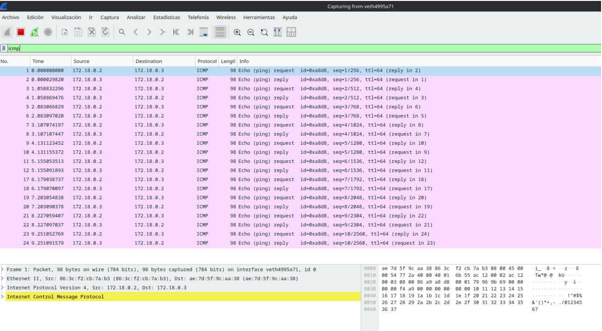
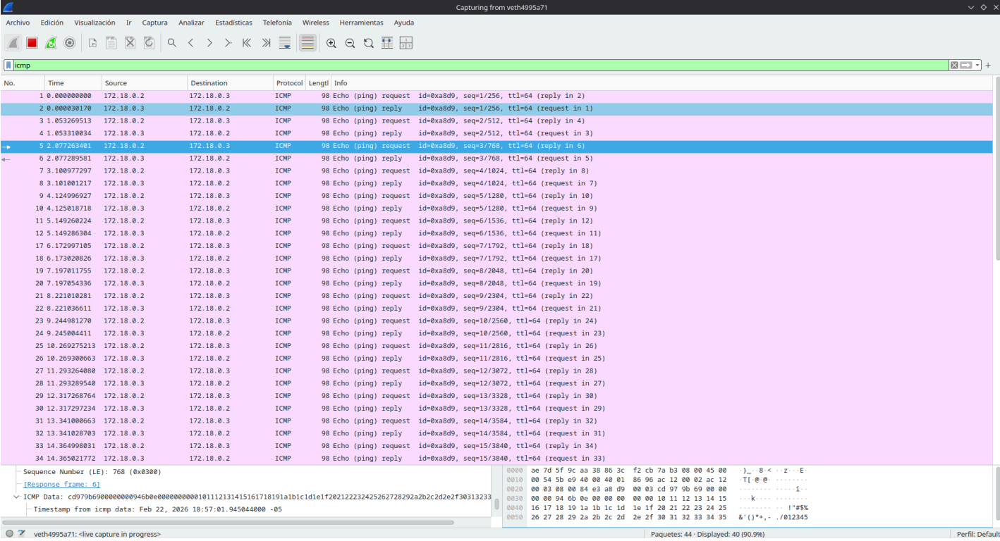

# Punto 3 — Midiendo latencia y jitter con ping

## Objetivo
Calcular la latencia (RTT) y observar la variabilidad (jitter) en las respuestas
ICMP, comparando el comportamiento de la red con y sin perturbación artificial.

---

## Herramientas necesarias

```bash
# iproute2 para el comando tc (traffic control)
sudo pacman -S iproute2
```

---

## Escenario Docker

Se reutiliza la misma red y contenedores del Punto 2.

Si los contenedores están detenidos, reiniciarlos:
```bash
docker start contenedor1
docker start contenedor2
```

Conectarse a cada uno en terminales separadas:

**Terminal A — contenedor1:**
```bash
docker exec -it contenedor1 sh
```

**Terminal B — contenedor2:**
```bash
docker exec -it contenedor2 sh
```

Verificar conectividad antes de comenzar:
```sh
# Desde contenedor1
ping -c 2 172.18.0.3
```

---

## Preparación de Wireshark

```bash
wireshark
```

- Seleccionar la interfaz `veth` correspondiente a `red_arp`
- Aplicar el filtro: `icmp`

---

## Procedimiento

**Iniciar la captura en Wireshark.**

Desde contenedor1, enviar 10 paquetes ICMP:
```sh
ping -c 10 172.18.0.3
```

**Resultado.**

El output del ping mostrará algo similar a:



En una red Docker local los RTT son muy bajos (< 1ms) y muy estables, lo que
indica prácticamente cero jitter.

En Wireshark cada par de paquetes **Echo Request / Echo Reply** representa
un ciclo completo. El tiempo entre ambos es el RTT.

---

### Parte 2 — Con perturbación (jitter artificial)

En el host, agregar un retardo artificial de **50ms ± 20ms** con distribución normal
sobre la interfaz `docker0`:

```bash
sudo tc qdisc add dev docker0 root netem delay 50ms 20ms distribution normal
```

**Explicación del comando:**
| Parte | Descripción |
|---|---|
| `tc qdisc add` | Agrega una disciplina de cola (queueing discipline) |
| `dev docker0` | Aplica sobre la interfaz docker0 |
| `root` | Se aplica al tráfico de salida (egress) |
| `netem` | Network Emulator: permite simular condiciones de red reales |
| `delay 50ms` | Agrega 50ms de retardo base a cada paquete |
| `20ms` | Variación aleatoria de ±20ms (el jitter) |
| `distribution normal` | La variación sigue una distribución normal (gaussiana) |

**Iniciar nueva captura en Wireshark.**

Desde contenedor1, enviar 20 paquetes:
```sh
ping -c 20 172.18.0.3
```

**Resultado.**

El output ahora mostrará RTT mucho mayores y con más variación:



**Limpiar la configuración de tc al terminar:**
```bash
sudo tc qdisc del dev docker0 root
```
---

## Análisis y respuestas

### ¿Se observa mayor variabilidad en la segunda captura?

Si hay variablidad. En la primera captura los RTT
son consistentemente bajos y casi idénticos entre sí (< 1ms), con una desviación mínima.
En la segunda captura los RTT rondan los 100ms
pero varían significativamente de un paquete al siguiente, con diferencias de hasta
40-50ms entre paquetes consecutivos. Es exactamente el jitter
que se introdujo en el comando `tc netem`.

### ¿Cómo se calcula el jitter?

La forma más simple de calcular el jitter es como la **diferencia absoluta entre
RTTs consecutivos**:

```
Jitter = |RTT(n) - RTT(n-1)|
```

Por ejemplo, con estos RTT de la segunda captura:
```
RTT1 = 98.3 ms
RTT2 = 112.7 ms  →  Jitter = |112.7 - 98.3| = 14.4 ms
RTT3 = 87.4 ms   →  Jitter = |87.4 - 112.7| = 25.3 ms
RTT4 = 134.1 ms  →  Jitter = |134.1 - 87.4| = 46.7 ms
```

El jitter promedio sería la media de todas esas diferencias. En la primera captura
el jitter calculado es prácticamente 0ms, confirmando que la
red Docker local es muy estable.

### ¿Qué es la latencia?

La latencia es el **tiempo que tarda un paquete en viajar desde el origen hasta
el destino**. En el contexto de `ping`, se mide como RTT (Round Trip Time), es
decir, el tiempo total de ida y vuelta del paquete.

**Factores que pueden causar latencia:**

- **Distancia física:** a mayor distancia entre origen y destino, mayor tiempo
  de propagación de la señal por el medio físico
- **Número de saltos (hops):** cada router intermedio que procesa y reenvía el
  paquete agrega un pequeño retardo
- **Congestión de red:** cuando hay mucho tráfico, los paquetes esperan en colas
  dentro de los routers antes de ser procesados
- **Procesamiento en dispositivos:** switches, firewalls y routers tardan un tiempo
  en inspeccionar y reenviar cada paquete
- **Tipo de medio:** la fibra óptica tiene menor latencia que el cable de cobre,
  y ambos mucho menor que las conexiones inalámbricas o satelitales

En el taller, la latencia base de la red Docker local es casi cero porque
los contenedores están en la misma máquina. El comando `tc netem delay 50ms`
simuló artificialmente la latencia que tendría una red real.

### ¿Qué es el jitter y por qué es importante para aplicaciones en tiempo real?

El jitter es la **variación en el tiempo de llegada de paquetes consecutivos**.
Mientras la latencia mide cuánto tarda un paquete, el jitter mide qué tan
irregular es ese tiempo entre un paquete y el siguiente.

Una red puede tener latencia alta pero jitter bajo (los paquetes siempre tardan
lo mismo) o latencia baja pero jitter alto (los paquetes llegan en momentos
impredecibles). Para las aplicaciones en tiempo real, el jitter es frecuentemente
más problemático que la latencia alta.

**¿Por qué afecta a VoIP?**

En una llamada de voz, los paquetes de audio deben llegar a intervalos regulares
para reconstruir el sonido correctamente. Si un paquete llega tarde o muy temprano
respecto al anterior, el receptor no puede reproducir el audio de forma continua,
causando cortes, silencios o distorsiones en la voz. Los sistemas VoIP usan
**buffers de jitter** para absorber esta variabilidad, pero si el jitter es muy
alto, el buffer no alcanza y la calidad de la llamada se degrada.

**¿Por qué afecta al gaming?**

En videojuegos en línea, el servidor necesita recibir las acciones de los jugadores
en orden y a tiempo para calcular el estado del juego correctamente. Un jitter alto
hace que las acciones lleguen en orden incorrecto o con retrasos variables, causando
el fenómeno conocido como **lag**: las acciones
no responden, o el juego muestra una imagen diferente a la del servidor. Muchos
juegos tienen tolerancia a cierta latencia fija, pero son muy sensibles al jitter.

[Regresar al README Principal](../README.md)